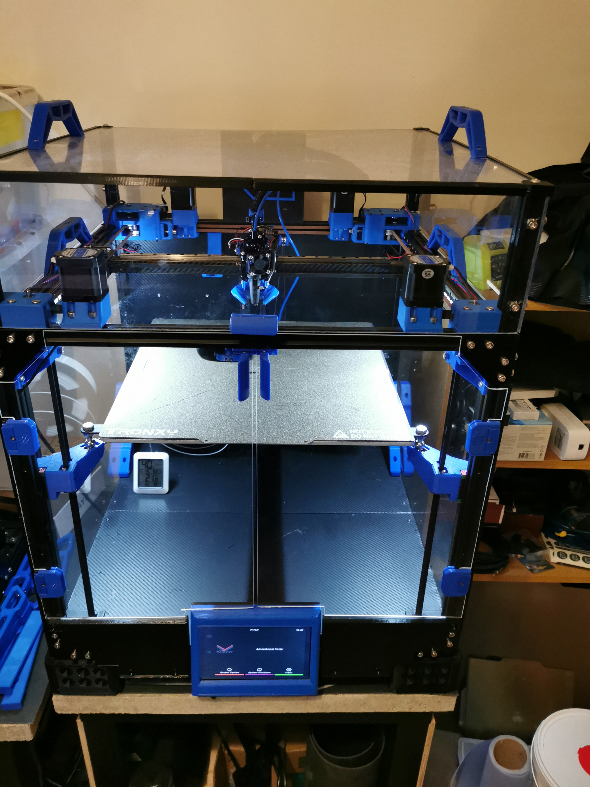
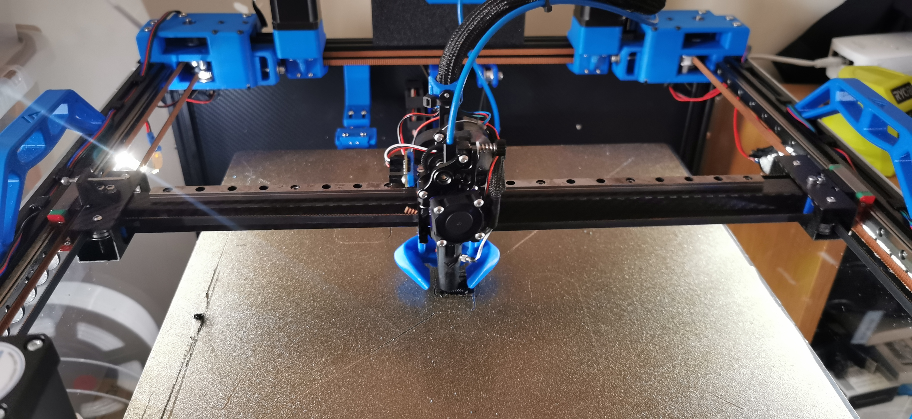

# Podrig-1

My Vzbot with a twist, 

belted triple Z using modded Ratrig arms with belted Z moved with Voron 2.4 gearboxes

I have now designed a XY motion system wher ethe motors are seperated from the XY belts, all idlers / pulleys are double shear includingthe motor mounts, the set up allows for the motors to be mounted inside or outside the printer (outside not tested as yet)

